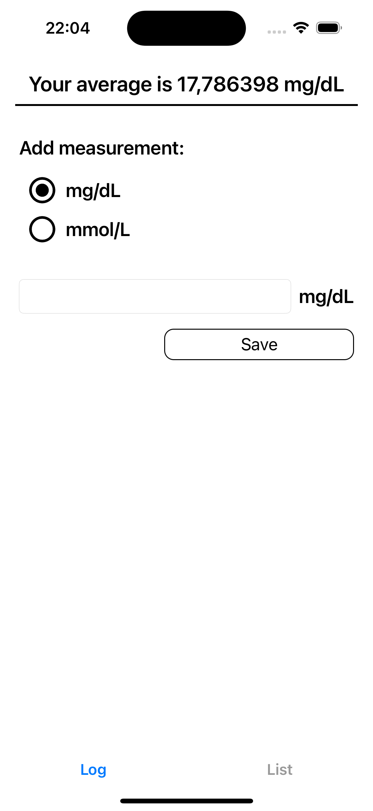

## MiniLogbook - The Blood Sugar Log **🩸**

MiniLogbook is an iOS Application to log your blood glucose, know what's your average with different displaying options ("mg/dL" and "mmol/L") and check past introduced values.

:warning: Please run "pod install" in order to get all the dependencies.

:warning: Requirements -  Use Xcode 13+ (iOS Deployment target is 15.0)

In this document i will give you an overview about the project.

### Requirements

- The user can select a unit for their blood glucose (BG) value (mmol/L or mg/dL)
- The user can enter a BG value with a numeric keyboard into a text field; the value must be >= 0
- A label next to the text field reflects the unit of the value the user is about to enter
- When the user presses “Save”, the value should be kept and a label displaying the user’s average BG values gets updated
- The user can create multiple values
- Clear the text input after a successful save
- Find a suitable way to display previously entered values
- Keep the values in memory or (for extra points) persist them
- Changing the unit updates all labels and converts the value in the text
field accordingly
- The conversion factor is 1 mmol/L = 18.0182 mg/dL
- Take proper measures to ensure that your code works correctly
- The mockup is only a suggestion, use native components as you see fit.

## Application overview :rocket:

### LogScreenView - Add a new value

Once the application loads, you'll notice there are two tabs (Log / List).
In this first screen you can see a title at the top where your average blood sugar will be displayed.
Two options that you can switch between them ("mg/dL" and "mmol/L")
Then a textfield so the user can introduce new values.

### ListScreenView

If you select the List tab you'll see a all of the saved values.
As you can see, all the data displayed in this screen are in mg/dL.

## Architecture and implementation details

The application is written in Swift and designed using MVVM :heart: architecture with Apple's Combine.

The functionality is divided in different scenes:

- Main scene

Represents the core of the application. Here is where you can introduce and save new data.

- List scene

Show the list of all the introduced values saved in UserDefaults.
I've used UserDefaults rather than CoreData or SwiftData because the complexity of the Models I'm using here are not enough to use such an overkill thing.

## Testing - Coverage is 82,7%

- ViewModels
- UseCases
- Adapter
- Snapshot Tests for all the views and cells

## Third party libraries

Main:
- Sourcery - https://github.com/krzysztofzablocki/Sourcery (Generate Swift files. In my case: AutoMockable)
- SnapKit - https://github.com/SnapKit/SnapKit (Constraints by code)

Test:
- Swift Snapshot Testing - https://github.com/pointfreeco/swift-snapshot-testing

## Improvements I have not done:

- Be able to display data in the List with the selected data type
- Create a UseCase to do the calculations depending on the input-output data type

## Support & contact

You can contact me via e-mail: carles828@gmail.com
